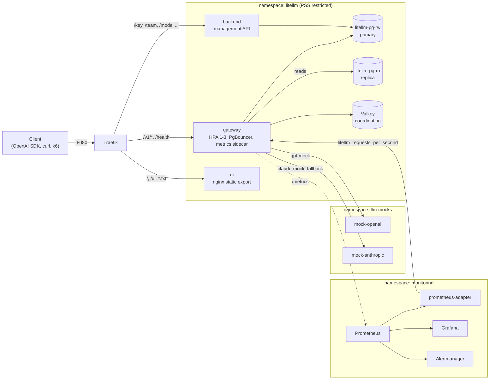

# Roundhouse

> Production-grade LiteLLM gateway on Kubernetes: SLO alerts, autoscaling, chaos drills, verified locally with kind

roundhouse는 기관차를 정비하고 방향을 돌려 다시 내보내는 차고입니다. 이 저장소는 기차(🚅)를 로고로 쓰는 [LiteLLM](https://github.com/BerriAI/litellm) AI Gateway를 Kubernetes에서 운영 수준으로 돌리기 위한 레퍼런스 플랫폼입니다. `make up` 한 번으로 노트북의 kind 클러스터에 전체 스택이 올라갑니다. 게이트웨이, Postgres HA, Valkey, 모니터링, 오토스케일링, SLO 알림까지 포함되고, 실제 LLM API 키 없이도 장애 주입과 부하 테스트까지 재현할 수 있습니다.

BerriAI의 공식 프로젝트가 아닌 커뮤니티 프로젝트입니다.

upstream의 componentized 차트(`helm/litellm`: gateway / backend / ui 분리)를 그대로 쓰고, 차트만으로는 부족한 부분은 이 저장소에서 보완합니다. 그 과정에서 찾은 upstream 문제는 [docs/upstream-findings.md](docs/upstream-findings.md)에 근거와 함께 정리했습니다.

## 아키텍처



| 구성 요소 | 역할 | 선택 이유 |
|---|---|---|
| LiteLLM componentized chart `v1.102.0` | gateway(데이터 플레인), backend(관리 API), ui 분리 배포 | 컴포넌트별 스케일링, pre-upgrade 마이그레이션 hook, 메트릭 사이드카, 커스텀 메트릭 HPA를 지원합니다. 레거시 `litellm-helm` 차트는 마이그레이션 경쟁 조건(#36938)이 있습니다 |
| CloudNativePG `1.30` + PostgreSQL `17.11` | primary + streaming replica, rw/ro Service | Bitnami 이미지가 유료화된 뒤로 레거시 차트의 번들 DB를 쓰기 어렵습니다. CNPG는 페일오버, 백업, PodMonitor를 오퍼레이터가 관리합니다 |
| Valkey `9.1` (공식 차트) | 파드 간 rpm/tpm 한도, spend 버퍼, pod lock | Redis 호환 오픈소스이고 ACL 인증을 씁니다 |
| Traefik `v3.7` | Ingress | ingress-nginx는 2026년 3월에 은퇴했습니다 |
| kube-prometheus-stack, prometheus-adapter, metrics-server | 수집, 대시보드, 알림, 커스텀 메트릭 HPA | 사실상 표준 스택입니다 |
| mock-llm (이 저장소) | OpenAI 호환 가짜 provider 2개, 지연과 에러 주입 | 비용 없이 재시도, fallback, 알림을 재현합니다 |

## 빠른 시작

필요한 것은 Docker Desktop(메모리 8GiB 이상 권장), kind, kubectl, helm 4, helmfile, jq입니다.

```bash
brew install kind helm helmfile jq
make doctor        # 도구와 Docker 메모리 점검
make up            # kind 클러스터 생성 -> Secret 부트스트랩 -> 차트 vendoring -> 전체 배포 (첫 실행 5~10분, 대부분 이미지 pull)
make smoke         # 키 발급부터 Prometheus 수집까지 end-to-end 검사
make urls          # 접속 주소와 자격 증명 출력
```

| 서비스 | 주소 |
|---|---|
| LiteLLM API (OpenAI 호환) | http://localhost:8080/v1 |
| LiteLLM Admin UI | http://localhost:8080/ui (admin / master key) |
| Grafana | http://localhost:3000 (LiteLLM 폴더의 "LiteLLM Gateway" 대시보드) |
| Prometheus | http://localhost:9090 |

OpenAI SDK는 base URL만 바꾸면 됩니다.

```python
from openai import OpenAI

client = OpenAI(base_url="http://localhost:8080/v1", api_key="<virtual key 또는 master key>")
client.chat.completions.create(model="gpt-mock", messages=[{"role": "user", "content": "hi"}])
```

`make smoke`의 실제 출력입니다.

```text
smoke test against http://localhost:8080
  ok    gateway readiness
  ok    backend minted a virtual key
  ok    chat completion routed to mock-openai
  ok    streaming returned 98 SSE chunks
  ok    embeddings
  ok    unknown key rejected with 401
  ok    spend recorded in Postgres: $0.000645
  ok    Prometheus scraped 4 requests from the gateway
all checks passed
```

## 데모 시나리오

### 1. 트래픽에 따른 오토스케일링

```bash
make load RATE=12 DURATION=2m
kubectl --context kind-llm-roundhouse -n litellm get hpa -w
```

gateway HPA는 CPU와 **파드당 초당 요청 수**(`litellm_requests_per_second`, prometheus-adapter가 제공)를 함께 봅니다. 메모리는 기준에서 뺐습니다. Python 워커는 메모리를 거의 반환하지 않아서, 메모리 기준을 넣으면 스케일 다운이 막힙니다.

측정 결과: 초당 12건에서 gateway가 1개에서 3개로 늘었고, 스케일 아웃 중 1,725건이 모두 성공했습니다(비스트리밍 p95 606ms).

### 2. provider 장애와 fallback

```bash
make chaos-errors          # mock-openai가 요청의 80%에 500을 반환
make load RATE=6 DURATION=4m
make chaos-off             # helmfile로 선언된 상태로 되돌림
```

`gpt-mock`이 실패하면 라우터가 `claude-mock`으로 fallback합니다. 결과는 다음과 같습니다.

| | 정상 | 80% 장애, `num_retries: 2` | 80% 장애, `retry_policy` 적용 |
|---|---|---|---|
| 클라이언트 실패율 | 0% | **0%** (1,590건) | **0%** (1,589건) |
| 비스트리밍 p95 | 606ms | **6.57s** | **996ms** |
| 알림 | 없음 | `ServingFromFallbacks`, `DeploymentDegraded` | 동일 |

처음 설정에서는 가용성은 지켰지만 지연이 10배로 늘었습니다. deployment가 하나뿐인 모델 그룹에서는 라우터가 fallback 전에 같은 provider에 지수 백오프를 두고 재시도하기 때문입니다([finding 5](docs/upstream-findings.md#5-router-single-deployment-groups-back-off-before-falling-back)). `router_settings.retry_policy`로 5xx는 재시도 없이 바로 fallback하게 바꾸자 p95가 996ms로 돌아왔습니다. 이 방법은 일시적인 5xx에서도 바로 fallback 모델로 넘어가는 절충입니다. 모델 그룹마다 deployment를 둘 이상(리전이나 provider를 달리해서) 두면 라우터가 다른 deployment로 백오프 없이 재시도하고 cooldown도 동작합니다. 라우터 자체의 수정은 upstream에 PR([BerriAI/litellm#42450](https://github.com/BerriAI/litellm/pull/42450))로 보냈습니다.

알림은 Prometheus에서 firing된 뒤 Alertmanager까지 도달하는 것까지 확인했습니다(로컬 receiver는 `null`).

### 3. 비용과 예산

`make load`는 예산 $20짜리 `load-test` 팀의 키로 트래픽을 보냅니다. mock 모델에도 `model_info`에 토큰 단가를 넣어 두었기 때문에 spend가 Postgres와 Prometheus에 쌓이고, 대시보드의 팀별 지출 속도와 남은 예산 패널, `LiteLLMTeamBudgetNearlyExhausted` 알림으로 이어집니다. 가격이 없는 모델이 $0으로 계산되면 `LiteLLMZeroCostBillableRequests`가 발생합니다.

## 관측성

**대시보드** "LiteLLM Gateway"는 [scripts/gen-dashboard.py](scripts/gen-dashboard.py)로 생성합니다. 다섯 개 영역으로 구성됩니다.

- Overview: 초당 요청 수, 5xx 비율, gateway overhead p95, 1시간 지출, 초당 토큰, 파드 수
- 트래픽과 라우팅: 모델별 요청, 상태 코드, deployment 실패율, fallback
- 지연: end-to-end, TTFT, gateway overhead와 대기열 시간
- 토큰과 비용: 입출력 토큰, 팀별 지출 속도, 팀별 남은 예산
- 용량: HPA 레플리카, 파드당 요청 수(HPA 신호), 파드별 CPU

**알림 규칙**은 [charts/litellm-observability/rules/litellm.yaml](charts/litellm-observability/rules/litellm.yaml)에 있고, Helm 템플릿과 분리해 두어서 `promtool`로 바로 검사할 수 있습니다.

| 그룹 | 알림 | 기준 |
|---|---|---|
| SLO | `ErrorBudgetBurnFast` / `Slow` | 가용성 99.5%, multi-window burn rate(14.4x 1h+5m, 6x 6h+30m) |
| 라우팅 | `DeploymentDegraded` / `Down`, `ServingFromFallbacks`, `FallbacksFailing` | deployment 실패율 20% / 95%, fallback 발생, fallback 실패 |
| 지연 | `GatewayOverheadHigh`, `RequestQueueing`, `ProviderLatencyHigh` | overhead p95 250ms, 대기열 p95 1s, provider p95 20s |
| 비용 | `TeamBudgetNearlyExhausted`, `ZeroCostBillableRequests` | 예산 10% 미만, $0으로 계산된 과금 요청 |
| 플랫폼 | `GatewayMetricsDown`, `GatewayAtMaxReplicas`, `RedisCircuitOpen`, `CallbackLoggingFailures`, `PostgresReplicationLag` | |

SLO는 gateway가 통제할 수 있는 것(자체 가용성과 overhead)만 다룹니다. provider 장애를 라우터가 흡수하고 있다면 warning이고, 클라이언트가 실제로 에러를 받을 때(`FallbacksFailing`, error budget burn)만 critical입니다.

`litellm_deployment_state`는 알림 기준으로 쓰지 않습니다. 성공 요청 하나가 들어올 때마다 healthy(0)로 덮어써지는 게이지라서, 70%가 실패하는 deployment도 대부분의 시간에 0으로 보이기 때문입니다. 장애 실험에서 `for: 2m` 알림이 한 번도 발생하지 않는 것을 확인하고 실패율 기반으로 바꿨습니다.

## 보안 기본값

- `litellm`, `llm-mocks` 네임스페이스는 Pod Security Standard `restricted`를 **enforce**합니다. 모든 파드가 non-root, `seccompProfile: RuntimeDefault`, capabilities 전부 drop으로 동작합니다(레거시 차트는 기본적으로 root로 실행됩니다, #40822)
- master key, salt key, Valkey 비밀번호, Grafana 비밀번호는 [scripts/bootstrap-secrets.sh](scripts/bootstrap-secrets.sh)가 한 번만 생성하고 다시 만들지 않습니다. salt key를 바꾸면 DB에 암호화해 둔 provider 자격 증명을 읽을 수 없게 됩니다
- Valkey는 ACL 인증을 쓰고, 모델 설정은 git에 둡니다(`store_model_in_db: false`). 모델 변경은 리뷰를 거친 PR이 되고 배포 이력이 남습니다
- helmfile의 모든 릴리스는 `kubeContext: kind-llm-roundhouse`로 고정되어 있어서, 다른 클러스터를 가리킨 상태에서 실수로 배포할 수 없습니다

## 디렉토리 구조

```text
cluster/kind.yaml                 단일 노드 kind, 8080/3000/9090 포트 매핑
environments/local.yaml           kubeContext, LiteLLM 버전(차트 git 태그 = 이미지 태그)
helmfile.yaml.gotmpl              릴리스 11개와 의존 순서(needs)
values/                           서드파티 차트 values
values/litellm/common.yaml        LiteLLM 플랫폼 설정(모델, 라우팅, 보안, 관측성)
values/litellm/local.yaml         로컬 사이징
charts/mock-llm/                  가짜 provider(표준 라이브러리만 쓰는 Python)
charts/litellm-data/              CNPG Postgres 클러스터 + PodMonitor
charts/litellm-edge/              Traefik 보완 라우트(Admin UI)
charts/litellm-observability/     PrometheusRule + Grafana 대시보드
scripts/                          doctor, bootstrap, smoke, load(k6), chaos, 대시보드 생성기
docs/upstream-findings.md         구축 중 찾은 upstream 문제와 기여 후보
```

## LiteLLM 차트 버전 관리

componentized 차트는 Helm/OCI 레지스트리에 배포되지 않습니다. 그래서 [scripts/fetch-litellm-chart.sh](scripts/fetch-litellm-chart.sh)가 이미지 태그와 같은 git 태그의 `helm/litellm`을 `.cache/charts/`로 가져옵니다. 형제 디렉토리에 LiteLLM clone(`../litellm`)이 있으면 `git archive`로 오프라인에서 가져오고, 없으면 sparse clone을 씁니다.

```bash
# 업그레이드: environments/local.yaml의 litellm.version만 바꾸면 차트와 이미지 4개가 같이 움직입니다
make chart deploy

# upstream 차트 수정을 로컬 클러스터에서 검증할 때
LITELLM_CHART_DIR=../litellm/helm/litellm make deploy
```

두 번째 방법이 이 저장소의 목적 중 하나입니다. upstream에 차트 PR을 보내기 전에, 실제 스택에서 먼저 검증할 수 있습니다.

## 차트 패키지

이 저장소의 차트 4개는 GHCR에 OCI 패키지로 올라가 있어서 clone 없이 설치할 수 있습니다.

```bash
helm show chart oci://ghcr.io/rosieoh/roundhouse/mock-llm --version 0.1.0
helm install mock-llm oci://ghcr.io/rosieoh/roundhouse/mock-llm --version 0.1.0 -n llm-mocks --create-namespace
```

| 차트 | 내용 |
|---|---|
| `litellm-data` | CloudNativePG Postgres(primary와 streaming replica, rw/ro Service, PodMonitor) |
| `litellm-edge` | LiteLLM 차트의 Ingress로 표현할 수 없는 Traefik 라우트 |
| `litellm-observability` | SLO recording rule, 알림, Grafana 대시보드 |
| `mock-llm` | 지연과 장애를 주입할 수 있는 OpenAI 호환 mock provider |

게시는 `helm registry login ghcr.io` 후 `make publish-charts`로 합니다. 같은 버전을 다시 push하면 덮어쓰므로, 바꿀 때마다 `Chart.yaml`의 `version`을 올립니다.

## Make 타깃

```text
make up / down            클러스터 생성과 전체 배포 / 삭제
make deploy / diff        helmfile sync / diff(helm-diff 플러그인 필요)
make smoke                end-to-end 검사
make load                 k6 부하(RATE, DURATION)
make chaos-errors         mock-openai 5xx 주입(ERROR_RATE, TARGET)
make chaos-ratelimit      429 주입
make chaos-slow           지연 주입(LATENCY_MS)
make chaos-off            선언된 상태로 복구
make status / urls        상태 / 접속 정보
make validate             helm lint, promtool, 렌더링 검사
make publish-charts       차트를 GHCR OCI 패키지로 게시
```

## 운영 환경으로 가져갈 때

로컬 프로파일은 약 8GiB 안에 들어가도록 줄여 둔 것입니다. 실제 트래픽을 받을 때는 다음을 바꿔야 합니다.

- **사이징**: gateway와 backend는 차트 기본값(파드당 1 CPU / 4GiB)에서 시작하고, `numWorkers`를 늘릴 때 PgBouncer의 `maxDbConnections`를 함께 계산합니다
- **데이터 계층**: CNPG에 object storage 백업(`barmanObjectStore`)과 PITR를 켜거나 RDS/Cloud SQL을 씁니다. Valkey는 복제본이 있는 매니지드 서비스로 바꿉니다
- **Secret**: bootstrap 스크립트 대신 External Secrets Operator나 Vault를 씁니다
- **토폴로지**: 멀티 AZ 노드 풀, `topologySpreadConstraints`를 zone 기준으로, `pdb.minAvailable`
- **메트릭 카디널리티**: LiteLLM은 요청 카운터에 `client_ip`, `user_agent`, `hashed_api_key`를 기본으로 붙입니다. 키와 사용자가 많아지면 `litellm_settings.prometheus_exclude_labels`(v1.102.0부터)로 필요 없는 라벨을 빼세요
- **알림 라우팅**: Alertmanager receiver(Slack, PagerDuty)를 연결하고 severity로 분기합니다
- **Ingress**: TLS, 그리고 `/metrics` 같은 내부 경로 차단

## Upstream 기여

이 플랫폼에서 측정한 문제를 upstream에 근거와 함께 기여합니다. 재현 방법은 [docs/upstream-findings.md](docs/upstream-findings.md)에, 진행 상황은 [Phase 1 · Upstream 기여](https://github.com/RosieOh/RoundHouse/milestone/2) 마일스톤에 있습니다.

| 기여 | 결과 | 상태 |
|---|---|---|
| LiteLLM 라우터: 단일 deployment 그룹이 fallback 전에 재시도 백오프를 기다림 | provider 장애 시 fallback 응답 중앙값 5.48초 → 0.73초 | PR [#42450](https://github.com/BerriAI/litellm/pull/42450) 리뷰 대기 |

## 로드맵

- [x] 차트를 GHCR OCI 패키지로 게시 [#32](https://github.com/RosieOh/RoundHouse/issues/32)
- [ ] ArgoCD app-of-apps로 GitOps 전환(차트 migration hook을 `argocd.enabled`로) [#33](https://github.com/RosieOh/RoundHouse/issues/33)
- [ ] CI: `make validate` + kind 기반 e2e(GitHub Actions) [#34](https://github.com/RosieOh/RoundHouse/issues/34)
- [ ] OpenTelemetry Collector + Tempo로 요청 트레이싱, Loki로 로그 [#35](https://github.com/RosieOh/RoundHouse/issues/35)
- [ ] `prometheus_exclude_labels`로 카디널리티를 제한한 프로파일 [#36](https://github.com/RosieOh/RoundHouse/issues/36)
- [ ] 모델 그룹당 deployment 2개 구성(백오프 없는 재시도와 cooldown)과 비교 [#37](https://github.com/RosieOh/RoundHouse/issues/37)
- [ ] Terraform EKS 모듈과 prod 환경 [#38](https://github.com/RosieOh/RoundHouse/issues/38)
- [ ] Gateway API(HTTPRoute) 지원 [#39](https://github.com/RosieOh/RoundHouse/issues/39)
- [ ] 공유 클러스터용 External Secrets Operator [#40](https://github.com/RosieOh/RoundHouse/issues/40)
